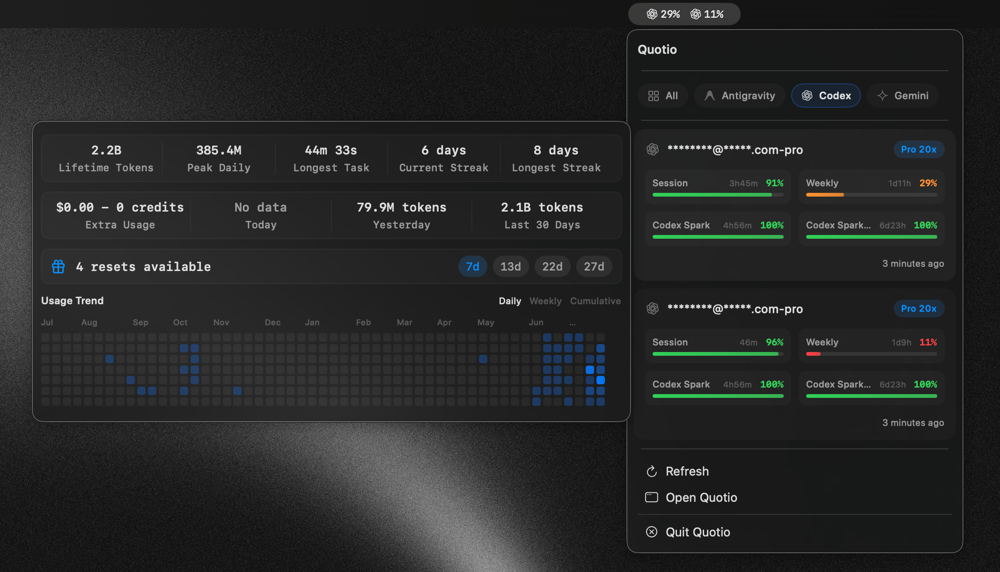
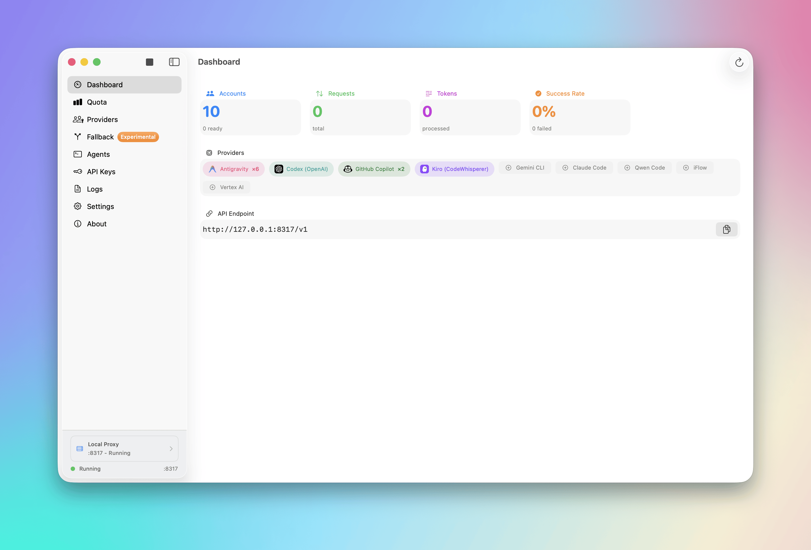
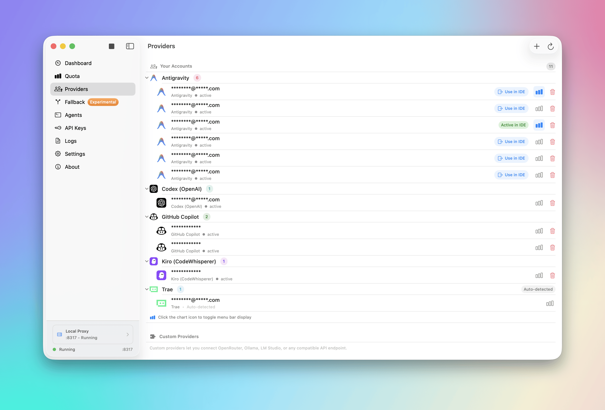
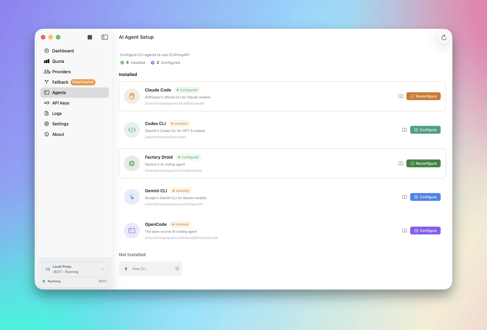
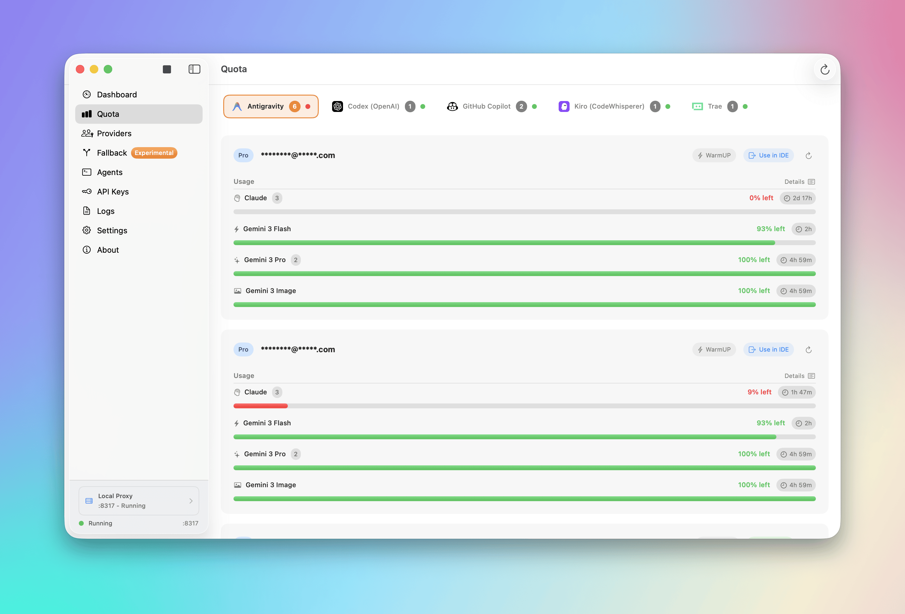
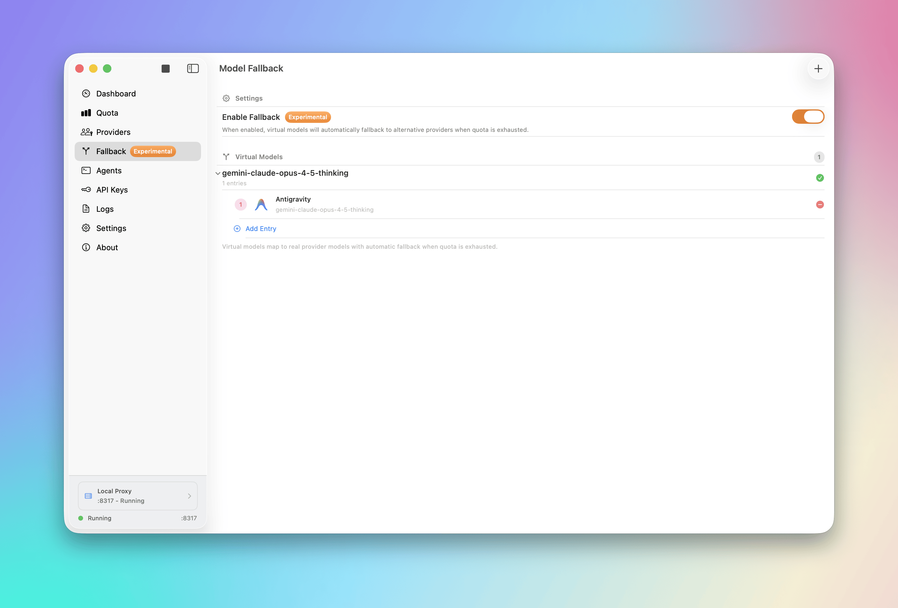
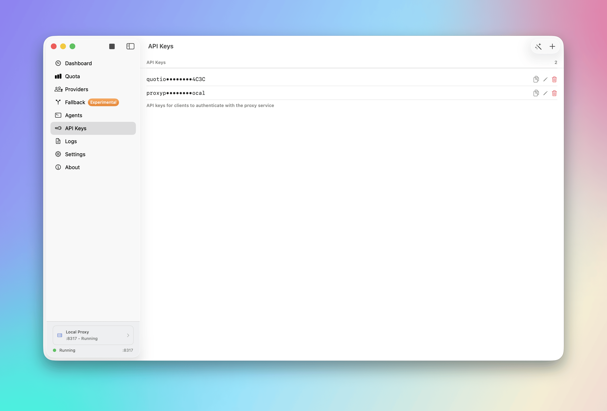
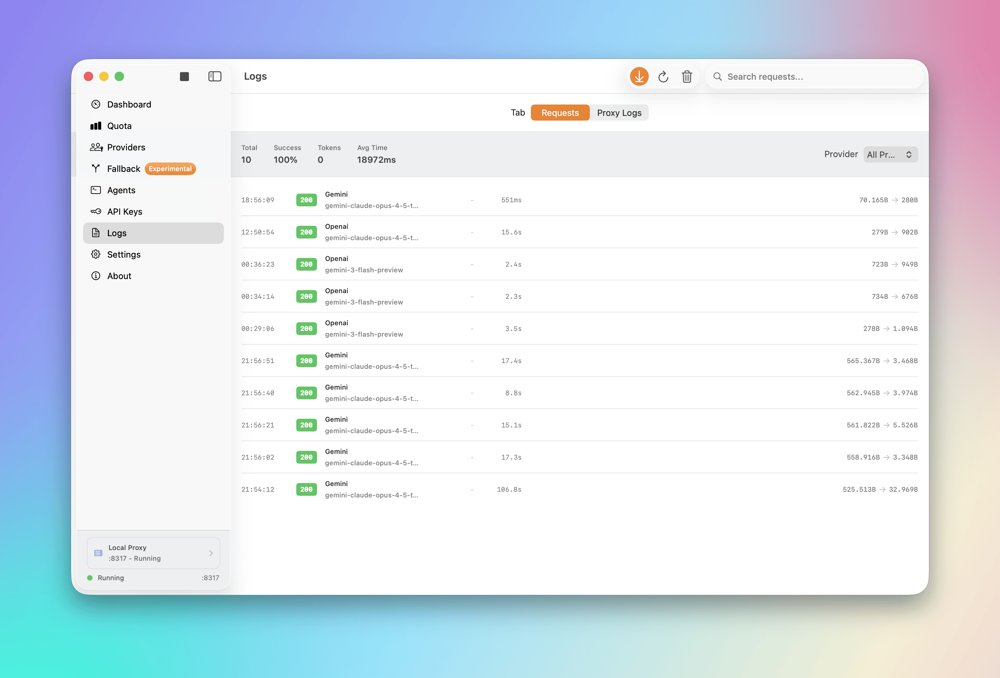
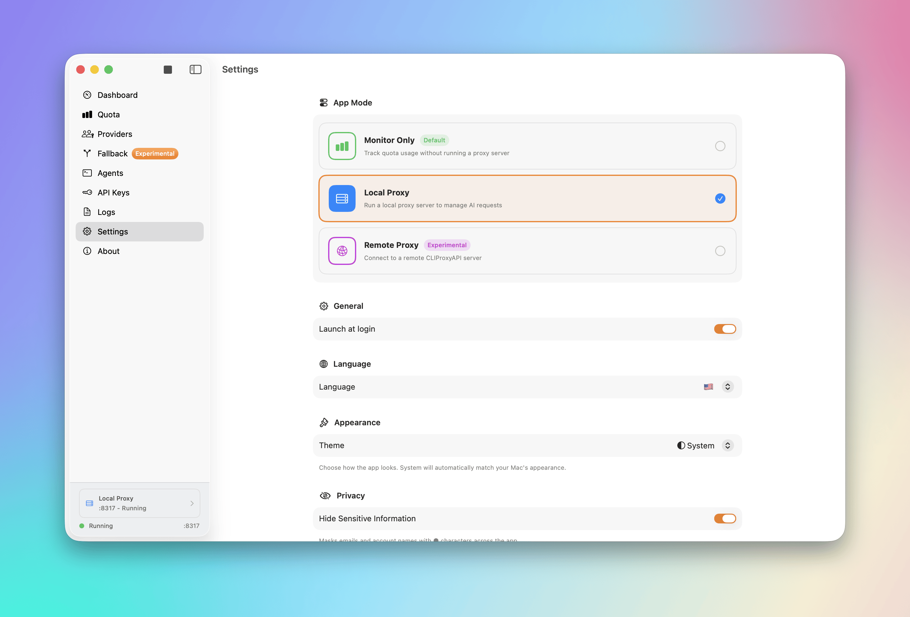

# Quotio

<p align="center">
  <picture>
    <source media="(prefers-color-scheme: dark)" srcset="screenshots/menu_bar_dark.png" />
    <source media="(prefers-color-scheme: light)" srcset="screenshots/menu_bar.png" />
    
  </picture>
</p>

<p align="center">
  
  
  
  <a href="https://discord.gg/dFzeZ7qS"></a>
  <a href="README.md"></a>
  <a href="README.vi.md"></a>
  <a href="README.zh.md"></a>
</p>

<p align="center">
  <a href="https://trendshift.io/repositories/16304?utm_source=repository-badge&amp;utm_medium=badge&amp;utm_campaign=badge-repository-16304" target="_blank" rel="noopener noreferrer"></a>
  <a href="https://trendshift.io/repositories/16304?utm_source=trendshift-badge&amp;utm_medium=badge&amp;utm_campaign=badge-trendshift-16304" target="_blank" rel="noopener noreferrer"></a>
  <a href="https://trendshift.io/repositories/16304?utm_source=trendshift-badge&amp;utm_medium=badge&amp;utm_campaign=badge-trendshift-16304" target="_blank" rel="noopener noreferrer"></a>
  <a href="https://trendshift.io/repositories/16304?utm_source=trendshift-badge&amp;utm_medium=badge&amp;utm_campaign=badge-trendshift-16304" target="_blank" rel="noopener noreferrer"></a>
  <a href="https://trendshift.io/repositories/16304?utm_source=trendshift-badge&amp;utm_medium=badge&amp;utm_campaign=badge-trendshift-16304" target="_blank" rel="noopener noreferrer"></a>
  <a href="https://trendshift.io/repositories/16304?utm_source=trendshift-badge&amp;utm_medium=badge&amp;utm_campaign=badge-trendshift-16304" target="_blank" rel="noopener noreferrer"></a>
</p>

<p align="center">
  <strong>Le centre de commande ultime pour vos assistants de codage IA sur macOS.</strong>
</p>

Quotio est une application macOS native pour gérer **CLIProxyAPI** - un serveur proxy local qui alimente vos agents de codage IA. Il vous aide à gérer plusieurs comptes IA, suivre les quotas et configurer les outils CLI en un seul endroit.

## ✨ Fonctionnalités

- **🔌 Support Multi-Fournisseurs** : Connectez des comptes de Gemini, Claude, OpenAI Codex, Qwen, Vertex AI, iFlow, Antigravity, Kiro, Trae et GitHub Copilot via OAuth ou clés API.
- **📊 Mode Quota Autonome** : Visualisez les quotas et les comptes sans exécuter le serveur proxy - idéal pour des vérifications rapides.
- **🚀 Configuration Agent en Un Clic** : Détection automatique et configuration des outils de codage IA comme Claude Code, OpenCode, Gemini CLI, et plus.
- **📈 Tableau de Bord en Temps Réel** : Surveillez le trafic des requêtes, l'utilisation des tokens et les taux de réussite en direct.
- **📉 Gestion Intelligente des Quotas** : Suivi visuel des quotas par compte avec stratégies de basculement automatique (Round Robin / Remplir d'abord).
- **🔑 Gestion des Clés API** : Générez et gérez les clés API pour votre proxy local.
- **🖥️ Intégration Barre de Menu** : Accès rapide à l'état du serveur, aperçu des quotas et icônes de fournisseurs personnalisés depuis votre barre de menu.
- **🔔 Notifications** : Alertes pour quotas faibles, périodes de refroidissement des comptes ou problèmes de service.
- **🔄 Mise à Jour Automatique** : Mise à jour Sparkle intégrée pour des mises à jour transparentes.
- **🌍 Multilingue** : Support anglais, vietnamien, chinois simplifié et français.

## 🤖 Écosystème Supporté

### Fournisseurs IA
| Fournisseur | Méthode d'Authentification |
|-------------|---------------------------|
| Google Gemini | OAuth |
| Anthropic Claude | OAuth |
| OpenAI Codex | OAuth |
| Qwen Code | OAuth |
| Vertex AI | JSON de compte de service |
| iFlow | OAuth |
| Antigravity | OAuth |
| Kiro | OAuth |
| GitHub Copilot | OAuth |

### Suivi de Quota IDE (Surveillance uniquement)
| IDE | Description |
|-----|-------------|
| Cursor | Détecté automatiquement lorsqu'installé et connecté |
| Trae | Détecté automatiquement lorsqu'installé et connecté |

> **Note** : Ces IDE sont uniquement utilisés pour la surveillance de l'utilisation des quotas. Ils ne peuvent pas être utilisés comme fournisseurs pour le proxy.

### Agents CLI Compatibles
Quotio peut configurer automatiquement ces outils pour utiliser votre proxy centralisé :
- Claude Code
- Codex CLI
- Gemini CLI
- Amp CLI
- OpenCode
- Factory Droid

## 🚀 Installation

### Prérequis
- macOS 14.0 (Sonoma) ou ultérieur
- Connexion Internet pour l'authentification OAuth

### Homebrew (Recommandé)
```bash
brew tap nguyenphutrong/tap
brew install --cask quotio
```

### Téléchargement
Téléchargez le dernier `.dmg` depuis la page [Releases](https://github.com/nguyenphutrong/quotio/releases).

> ⚠️ **Note** : L'application n'est pas encore signée avec un certificat Apple Developer. Si macOS bloque l'application, exécutez :
> ```bash
> xattr -cr /Applications/Quotio.app
> ```

### Compilation depuis les Sources

1. **Clonez le dépôt :**
   ```bash
   git clone https://github.com/nguyenphutrong/quotio.git
   cd Quotio
   ```

2. **Ouvrez dans Xcode :**
   ```bash
   open Quotio.xcodeproj
   ```

3. **Compilez et Exécutez :**
   - Sélectionnez le schéma "Quotio"
   - Appuyez sur `Cmd + R` pour compiler et exécuter

> L'application téléchargera automatiquement le binaire `CLIProxyAPI` au premier lancement.

## 📖 Utilisation

### 1. Démarrer le Serveur
Lancez Quotio et cliquez sur **Démarrer** dans le tableau de bord pour initialiser le serveur proxy local.

### 2. Connecter des Comptes
Allez dans l'onglet **Fournisseurs** → Cliquez sur un fournisseur → Authentifiez-vous via OAuth ou importez des identifiants.

### 3. Configurer les Agents
Allez dans l'onglet **Agents** → Sélectionnez un agent installé → Cliquez sur **Configurer** → Choisissez le mode Automatique ou Manuel.

### 4. Surveiller l'Utilisation
- **Tableau de bord** : Santé générale et trafic
- **Quota** : Détail de l'utilisation par compte
- **Logs** : Logs bruts requête/réponse pour le débogage

## ⚙️ Paramètres

- **Port** : Modifier le port d'écoute du proxy
- **Stratégie de Routage** : Round Robin ou Remplir d'abord
- **Démarrage Automatique** : Lancer le proxy automatiquement à l'ouverture de Quotio
- **Notifications** : Activer/désactiver les alertes pour divers événements

## 📸 Captures d'Écran

### Tableau de Bord
<picture>
  <source media="(prefers-color-scheme: dark)" srcset="screenshots/dashboard_dark.png" />
  <source media="(prefers-color-scheme: light)" srcset="screenshots/dashboard.png" />
  
</picture>

### Fournisseurs
<picture>
  <source media="(prefers-color-scheme: dark)" srcset="screenshots/provider_dark.png" />
  <source media="(prefers-color-scheme: light)" srcset="screenshots/provider.png" />
  
</picture>

### Configuration des Agents
<picture>
  <source media="(prefers-color-scheme: dark)" srcset="screenshots/agent_setup_dark.png" />
  <source media="(prefers-color-scheme: light)" srcset="screenshots/agent_setup.png" />
  
</picture>

### Surveillance des Quotas
<picture>
  <source media="(prefers-color-scheme: dark)" srcset="screenshots/quota_dark.png" />
  <source media="(prefers-color-scheme: light)" srcset="screenshots/quota.png" />
  
</picture>

### Configuration de Secours
<picture>
  <source media="(prefers-color-scheme: dark)" srcset="screenshots/fallback_dark.png" />
  <source media="(prefers-color-scheme: light)" srcset="screenshots/fallback.png" />
  
</picture>

### Clés API
<picture>
  <source media="(prefers-color-scheme: dark)" srcset="screenshots/api_keys_dark.png" />
  <source media="(prefers-color-scheme: light)" srcset="screenshots/api_keys.png" />
  
</picture>

### Journaux
<picture>
  <source media="(prefers-color-scheme: dark)" srcset="screenshots/logs_dark.png" />
  <source media="(prefers-color-scheme: light)" srcset="screenshots/logs.png" />
  
</picture>

### Paramètres
<picture>
  <source media="(prefers-color-scheme: dark)" srcset="screenshots/settings_dark.png" />
  <source media="(prefers-color-scheme: light)" srcset="screenshots/settings.png" />
  
</picture>

### Barre de Menu
<picture>
  <source media="(prefers-color-scheme: dark)" srcset="screenshots/menu_bar_dark.png" />
  <source media="(prefers-color-scheme: light)" srcset="screenshots/menu_bar.png" />
  
</picture>

## 🤝 Contribuer

1. Forkez le Projet
2. Créez votre Branche de Fonctionnalité (`git checkout -b feature/fonctionnalite-geniale`)
3. Commitez vos Modifications (`git commit -m 'Ajout d'une fonctionnalité géniale'`)
4. Poussez vers la Branche (`git push origin feature/fonctionnalite-geniale`)
5. Ouvrez une Pull Request

## 💬 Communauté

Rejoignez notre communauté Discord pour obtenir de l'aide, partager vos commentaires et vous connecter avec d'autres utilisateurs :

<a href="https://discord.gg/dFzeZ7qS">
  
</a>

## ⭐ Historique des Étoiles

<picture>
  <source
    media="(prefers-color-scheme: dark)"
    srcset="
      https://api.star-history.com/svg?repos=nguyenphutrong/quotio&type=Date&theme=dark
    "
  />
  <source
    media="(prefers-color-scheme: light)"
    srcset="
      https://api.star-history.com/svg?repos=nguyenphutrong/quotio&type=Date
    "
  />
  
</picture>

## 📊 Activité du Repo


## 💖 Contributeurs

Nous n'aurions pas pu y arriver sans vous. Merci ! 🙏

<a href="https://github.com/nguyenphutrong/quotio/graphs/contributors">
  
</a>

## 📄 Licence

Licence MIT. Voir `LICENSE` pour plus de détails.
