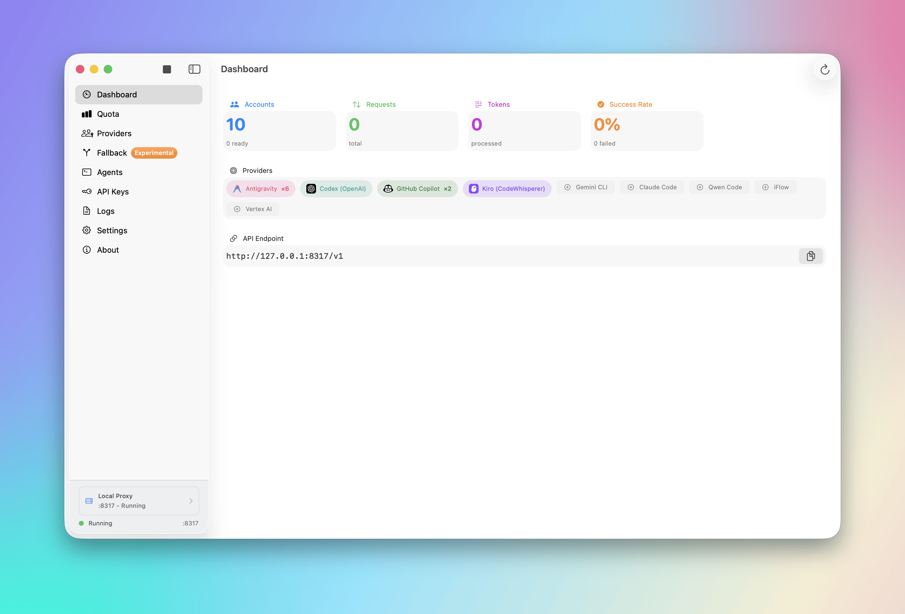

# Quotio

<p align="center">
  
</p>

<p align="center">
  <a href="https://github.com/nguyenphutrong/quotio/releases">
    
  </a>
  <a href="https://www.npmjs.com/package/quotio">
    
  </a>
  
  <a href="LICENSE">
    
  </a>
</p>

<p align="center">
  <strong>Your command center for AI coding quotas, accounts, and local agents.</strong>
</p>

<p align="center">
  Quotio helps you see what quota remains, manage provider accounts, operate
  CLIProxyAPI, and connect your coding agents—from a native macOS app or the terminal.
</p>

<p align="center">
  <a href="#install-quotio">Install Quotio</a> ·
  <a href="apps/macos/README.md">macOS app documentation</a> ·
  <a href="apps/cli/README.md">CLI documentation</a> ·
  <a href="https://github.com/nguyenphutrong/quotio/releases">GitHub releases</a>
</p>

## Stay ahead of your AI limits

Quotio puts provider usage and local tooling in one place, so you can spend less
time checking dashboards and editing configuration files.

- **See quota at a glance.** Track account limits and reset windows from the menu
  bar, desktop app, terminal, JSON output, or local REST API.
- **Bring your accounts together.** Use supported OAuth, API key, CLI, and native
  credential sources without copying secrets into project files.
- **Run your local proxy with confidence.** Start and monitor CLIProxyAPI, manage
  routing, and keep provider accounts close to the tools that use them.
- **Connect coding agents faster.** Detect and configure Claude Code, Codex CLI,
  Amp, OpenCode, and Factory Droid while preserving existing user settings.
- **Choose the interface that fits.** Use the native macOS experience for daily
  work or the Rust CLI for scripts, headless systems, and automation.

## Choose your Quotio

| Product | Best for | Platforms |
| --- | --- | --- |
| [Quotio for macOS](apps/macos/README.md) | Visual quota monitoring, account management, CLIProxyAPI lifecycle, agent setup, menu bar access, and automatic updates | macOS 14 or later |
| [Quotio CLI](apps/cli/README.md) | Fast text or JSON reports, scripting, saved accounts, and a loopback REST API | macOS Apple Silicon/Intel and Linux x64 |

Both products live in this repository and share one goal: make AI coding usage
visible and manageable without sending your credentials through a hosted Quotio
service.

## Quotio for macOS

The native SwiftUI app is the full command center. It combines provider quota,
account setup, local proxy controls, agent configuration, notifications, and updates
in a desktop app that stays close in the menu bar.

<picture>
  <source media="(prefers-color-scheme: dark)" srcset="apps/macos/screenshots/dashboard_dark.png" />
  <source media="(prefers-color-scheme: light)" srcset="apps/macos/screenshots/dashboard.png" />
  
</picture>

Read the [complete macOS feature guide and screenshot gallery](apps/macos/README.md).
The macOS guide is also available in
[Vietnamese](apps/macos/README.vi.md),
[Simplified Chinese](apps/macos/README.zh.md), and
[French](apps/macos/README.fr.md).

## Quotio CLI

The standalone Rust CLI brings quota checks to your terminal and automation. It
supports a broad provider catalog, private saved-account storage, deterministic JSON
reports, and an optional loopback REST API. Distributed packages contain native
binaries, so npm and Homebrew installs do not require a Rust toolchain.

```console
$ quotio providers
$ quotio usage
$ quotio usage --provider mock --format json
```

Read the [CLI usage, provider, account, and API documentation](apps/cli/README.md).

## Supported ecosystem

Quotio works with providers and services including Anthropic Claude, OpenAI Codex,
Gemini and Vertex AI, GitHub Copilot, Qwen, Kiro, Antigravity, and many more.
Provider availability and authentication methods vary between the macOS app and CLI;
their product documentation contains the current support matrix.

The macOS app can configure these coding agents to use your local proxy:

- Claude Code
- Codex CLI
- Amp
- OpenCode
- Factory Droid

## Install Quotio

### macOS app

```bash
brew install --cask nguyenphutrong/tap/quotio
```

You can also download the signed and notarized DMG from the
[latest macOS release](https://github.com/nguyenphutrong/quotio/releases/latest).

### CLI

Install the CLI with Homebrew:

```bash
brew install nguyenphutrong/tap/quotio
```

Or install the same native binaries through npm:

```bash
npm install --global quotio
```

See the [CLI release-channel documentation](apps/cli/docs/release-channels.md) for
prerelease channels and supported release targets.

## Repository layout

- [`apps/macos/`](apps/macos) — Swift and SwiftUI macOS application.
- [`apps/cli/`](apps/cli) — cross-platform Rust command-line client.
- [`Packages/QuotioCore/`](Packages/QuotioCore) — shared Swift package for the Apple app.
- [`.github/workflows/`](.github/workflows) — independent CI and release pipelines for each product.

## Development

Run checks from the repository root:

```bash
# macOS core and architecture
swift test --package-path Packages/QuotioCore
./apps/macos/scripts/check_architecture.sh

# macOS app
xcodebuild \
  -project apps/macos/Quotio.xcodeproj \
  -scheme Quotio \
  -configuration Debug \
  -destination 'platform=macOS' \
  test

# CLI
cargo test --manifest-path apps/cli/Cargo.toml --locked --all-features
```

Use `v*` tags for macOS releases and `cli-v*` tags for CLI releases. See each
product README for build, architecture, security, and release details.

## Contributing

Bug reports, feature ideas, documentation improvements, and code contributions are
welcome. Use the repository's
[GitHub issue templates](https://github.com/nguyenphutrong/quotio/issues/new/choose)
to provide the context needed to investigate your request.

## License

Quotio is available under the [MIT License](LICENSE).
